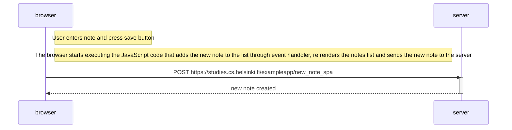

```mermaid
sequenceDiagram
    participant browser
    participant server

    Note right of browser: User enters note and press save button

    Note right of browser: The browser starts executing the JavaScript code that adds the new note to the list through event handdler, re renders the notes list and sends the new note to the server

    browser->>server: POST https://studies.cs.helsinki.fi/exampleapp/new_note_spa
    activate server
    server-->>browser: new note created
    deactivate server

```